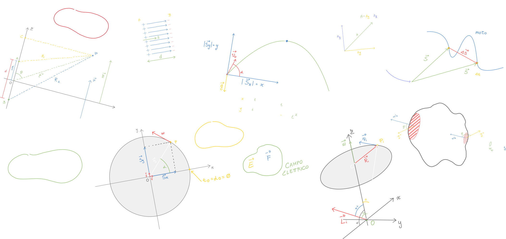

# Fisica

Repository dedicata agli appunti di Fisica 1 e 2

# Lista argomenti lezioni

## Fisica 2

Gli argomenti di Fisica 2 vengono approfonditi grazie al libro `Fisica II Elettromagnetismo Ottica. Mencuccini Silvestrini. Terza edizione del 1998.`

### Lezione 24

**INIZIO DEL CAPITOLO SULL'ELETTROSTATICA**

- Flusso del vettore velocità e la sua astrazione

- Circolazione di un vettore e la sua astrazione

- Operatori differenziali
  
  - gradiente
  
  - divergenza
  
  - rotore
  
  - Laplaciano di un campo scalare
  
  - Laplaciano di un campo vettoriale

### Lezione 25

- Teorema della divergenza

- Teorema del rotore

### Lezione 26

- Teorema di Coulomb: campo elettrico in prossimità di un conduttore carico

- **Prima equazione di Maxwell**

- Equazione di poisson DA APPROFONDIRE DAGLI APPUNTI PDF

### Lezione 27

- Filo carico (Gauss)

- Strato carico (Gauss)

- Doppio strato carico (Gauss)

- Filo carico di lunghezza l

- Anello carico a distanza z

### Lezione 28

- Introduzione al concetto di **capacità**

- Condensatore piano

- Condensatore sferico

- Condensatore cilindrico: cavo coassiale

- Disco carico

Esercizi: `Esame 19-03-14, Esame 13-04-12`

### Lezione 29

- Condensatori in un circuito

- Energia del campo elettromagnetico

- Dipolo elettrico: calcolo del **potenziale** in un punto P.

### Lezione 30

- Dipolo elettrico: applicazione del potenziale per il calcolo del **campo elettrico**.

**FINE DEL CAPITOLO SULL'ELETTROSTATICA**

**INIZIO DEL CAPITOLO SULLE CORRENTI**

- IV.2. Corrente elettrica

- IV.3. Densità di corrente

- Principio di conservazione della carica elettrica

- Corrente stazionaria

- Prima legge di **Kirchhoff**

- IV.4. Resistenza elettrica e legge di Ohm

### Lezione 31

- Effetto Joule

- Seconda legge di Ohm

- Modello di Drude (per l'effetto Joule)

### Lezione 32

- Forza elettromotrice

- Visione del video su [La forza elettromotrice - YouTube](https://www.youtube.com/watch?v=HsKduCX9Tvk&ab_channel=GabriellaPaltrinieri)

- Legge di Ohm generalizzata

- Legge di Kirchhoff sulle maglie

- Esempio di esercizio di elettrotecnica

- Esercizi di elettromagnetismo per l'esame scritto **<u>(da controllare!)</u>**

- Introduzione al campo magnetico (senza formule!)

### Lezione 33

- Visione del video su [TEORIA Magneti naturali e artificiali AMALDI ZANICHELLI - YouTube](https://www.youtube.com/watch?v=g0D9rdmERDE&ab_channel=DIDATTICAMENTE)
- Definizione del campo magnetico
  
  - Definizione "semplice": partendo dalla forza di Coulomb definiamo il campo magnetico come la forza diviso la carica magnetica
  
  - Definizione più complessa: a partire dalla **carica elettrica** si trova la **forza di Lorentz** che descrive il campo magnetico.
  
  - Forza di Lorentz in presenza di un campo magnetico ed elettrico
- <u>Flusso </u>del campo magnetico: **Prima equazione di Maxwell per la magnetostatica.**
  
  - Forma integrale
  
  - Forma differenziale
- Legge di **Biot - Savart**
- Generalizzazione della legge di Biot - Savart: **Prima e seconda formula di Laplace**

### Lezione 34

- Esempi di applicazione della seconda formula di Laplace
  
  - Campo magnetico di una spira

- Momento magnetico della spira

- Esempi di a**pplicazioni della forza di Lorentz** (<u>utili per la risoluzione degli esercizi d'esame</u>)
  
  - Carica attraverso le armature di un condensatore piano 1:20
  
  - Carica avente velocità parallela al campo magnetico ed elettrico 1:25
  
  - Lo spettrometro di massa 1:33

- Approfondimento sullo spettrometro di massa: come accelerare un isotopo con una differenza di potenziale misurarne la massa.

### Lezione 35

- Calcolo del campo magnetico del solenoide

- Legge di Ampere (<u>circuitazione</u>): **seconda equazione di Maxwell per la Magnetostatica.**
  
  - Forma integrale
  
  - Forma differenziale

- Linea chiusa non concatenata al filo

- Equazione di Poisson nel campo magnetico

- Trasformazioni di Gauge

### Lezione 36

- ~~L'ultimo argomento delle correnti (Teorema di equivalenza di Ampere) verrà trattato alla fine del corso.~~

- Teorema di equivalenza di Ampere -> Lezione 42

FINE DEL CAPITOLO SULLE CORRENTI

INIZIO DEL CAPITOLO SUL CAMPO ELETTROMAGNETICO

- Visione del video su 

- dimostrazione della **legge di faraday**:
  
  - Forza elettromotrice derivata dalla forza di Lorentz
  
  - Forza elettromotrice derivata dalla derivata del flusso (Faraday)

- 

- Visione del video su [TEORIA La legge di Lenz AMALDI ZANICHELLI - YouTube](https://www.youtube.com/watch?v=GjR035T1uqA&ab_channel=DIDATTICAMENTE)

- Spiegazione della legge di Lenz

- Esercizi [da visionare!]

### Lezione 37

- Fenomeno dell'autoinduzione 00\:02:00

- Corrente di spostamento 00:55

- spiegazione di tutte le equazioni di Maxwell nella forma piu generale possibile 01:37

### Lezione 38

- Considerazioni sulle equazioni di maxwell: ricavare altre equazioni notevoli dalle eq di Maxwell.
- Definire le onde elettromagnetiche a partire dalle equazioni di maxwell
  
  - Isolare il campo magnetico
  
  - Isolare il campo elettrico
  
  - Trovare **l'equazione dell'onda elettromagnetica**
  
  - La luce è un'onda elettromagnetica

### Lezione 39

- Principio di sovrapposizione.

- Teorema di Fourier: La trasformata.

- Pacchetti d'onda.
  
  - Pacchetti in un mezzo dispersivo.
  
  - Pacchetti in un mezzo **non** dispersivo.
  
  - Velocità di gruppo
  
  - Velocità di fase

- Differenza tra velocità di gruppo e velocità di fase

- Interferenza
  
  - Costruttiva
  
  - Distruttiva
  
  - Cenni sulle sorgenti **coerenti**.

### Lezione 40

- 

### Lezione 41

- Il motorino unipolare

### Lezione 42

- Teorema di equivalenza di Ampere (della parte delle correnti elettriche) ed applicazioni
  
  - Campo E prodotto da un dipolo elettrico e campo B prodotto da un dipolo magnetico (magnete lineare)
  
  - Campo magnetico B prodotto da una spira
  
  - Momento agente su un dipolo elettrico immerso in un campo E
  
  - Momento agente su un dipolo magnetico immerso in un campo B
  
  - Momento di una spira attraversata da una corrente, immersa in un campo B

## Materiale aggiuntivo

### Equazioni di Maxwell

- Spiegazione veloce: https://youtube.com/shorts/LYytSXnSCOI?feature=share
